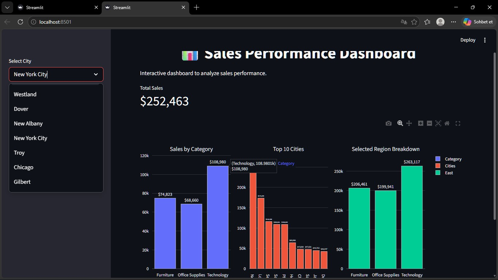

## sales-dashboard

An interactive sales analytics dashboard built using Python, Streamlit, Pandas, and Plotly.

## Features
- Visualizes sales and profit trends over time
- Displays top-performing cities by sales and profit
- Calculates and analyzes profit margins
- Interactive filters for dynamic data exploration

## Technologies Used
- Python
- Pandas
- Streamlit
- Plotly

## Dashboard Preview


## How to Run
```bash
pip install -r requirements.txt
streamlit run app3.py 
